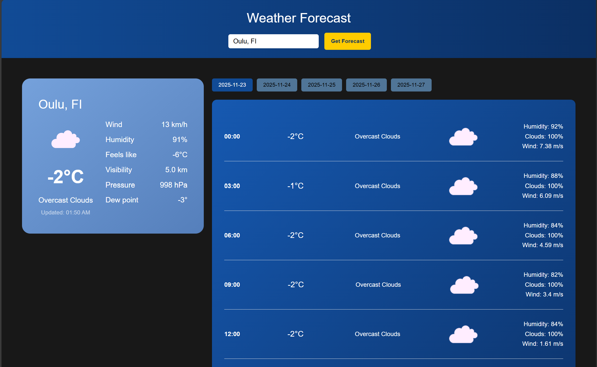

# Weather App



A simple weather application to fetch and display real time weather information and forecast for 5 days.

## Features
- Weather forecast for 5 days for a given city.
- Display current weather and refreshes every 10 minutes.
- App uses `openweathermap` data to get the geo coordinates and the weather data by using following endpoints:
  - http://api.openweathermap.org/geo/1.0/direct?q={city},{state},{country}&limit={limit}&appid={API_key} - for geo coordinates
  - http://api.openweathermap.org/data/2.5/forecast?lat={lat}&lon={lon}&appid={API_key} - for weather forecast for 5 days (per 3 hours)
  - https://api.openweathermap.org/data/2.5/weather?lat={lat}&lon={lon}&appid={API_key} - to get the current weather at any given coordinate

## Requirements
- Node.js
- npm (or yarn)

## Quick Start

**Install dependencies:**

```powershell
npm install
```

**Run the dev server:**

```powershell
npm run dev
```

Open http://localhost:5173 in your browser.

**Environment / API keys**
- App needs `openweathermap` API key, create a `.env` file in the project root and add keys prefixed with `VITE_`, for example:

```text
VITE_WEATHER_API_KEY=your_api_key_here
```

- Access environment variables in code via `import.meta.env.VITE_WEATHER_API_KEY`.

## Future Improvements
- Better UX/UI and responsivness
- Add possibility to change between °F/°C
- Improve the weather forcast for 5 days UI by adding more details to the tabs

## Contributing
- Feel free to open issues or submit PRs with improvements.

## License & Credits
- This project is licensed under the MIT License - see the [LICENSE](LICENSE) file for details.
- Weather data and forecasts provided by OpenWeatherMap — https://openweathermap.org/